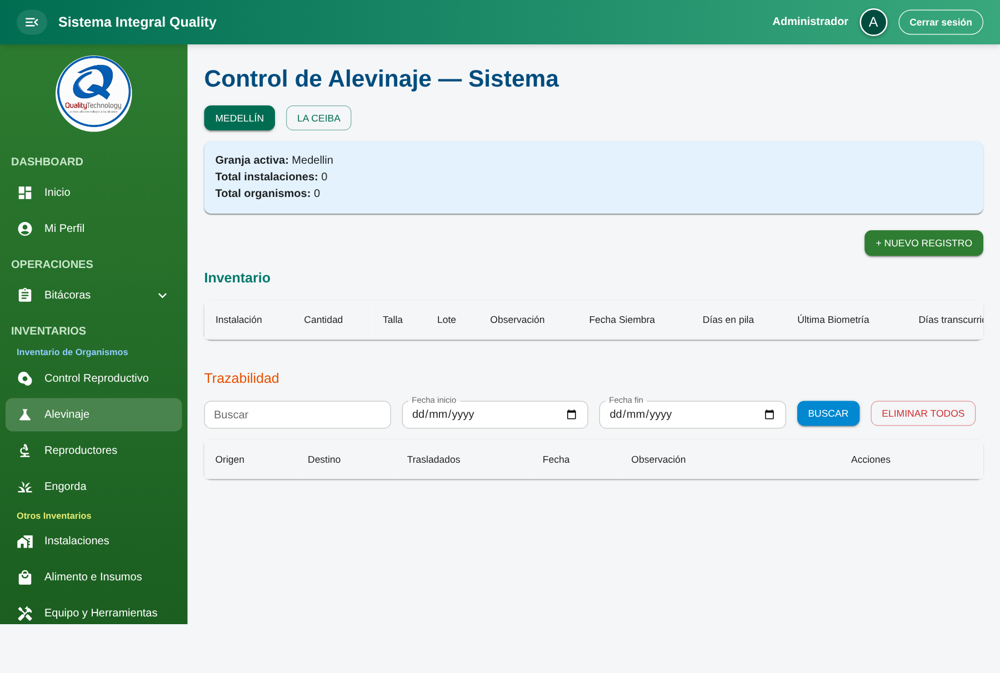

# Flujo para llenar los módulos de Inventarios

Guía paso a paso del orden correcto para capturar datos en el módulo **Inventarios** del sistema, respetando las dependencias reales entre componentes del frontend y los endpoints del backend.

> Cada módulo depende de datos previamente creados en otro. Llenarlos fuera de orden causa que los selectores aparezcan vacíos y los registros no se puedan guardar.

## 1. Mapa de dependencias

El módulo **Instalaciones** se retiró de la app: la **infraestructura base** es una sola pantalla, **Piletas físicas** (modelo `Pileta`), donde defines cada estanque con su **etapa** (`alevinaje`, `reproductores`, `engorda`). Todo lo demás cuelga de esas piletas creadas en la sede/granja activa.

```
┌────────────────────────────┐
│   Piletas físicas          │  ← BASE. CRUD modelo `Pileta`
│   (etapa: Alev / Rep / Eng) │     (nombre, dimensiones, material, estado…)
└─────────────┬──────────────┘
              │
     ┌────────┼─────────────────────────┬──────────────────┐
     ▼        ▼                         ▼                  ▼
┌──────────────┐  ┌──────────────────────────┐   ┌──────────────┐
│ Reproductores│  │   Lotes (control repro.) │   │   Equipos    │
│ piletas tipo │  │  (tras reproductores;    │   │ (indepen-    │
│ reproductores│  │   selector API legacy)   │   │  diente)     │
└──────┬───────┘  └────────────┬─────────────┘   └──────────────┘
       │                       │
       └───────────┬───────────┘
                   │
                   │ (siembra opcional → ver Alevinaje)
                   ▼
          ┌────────────────────────┐
          │  Registros Alevinaje   │  ← Tabla `alevinaje`; solo piletas
          │  (piletas etapa       │     etapa `alevinaje`
          │   alevinaje)          │
          └───────────┬────────────┘
                      ▼
          ┌────────────────────────┐
          │    Engorda             │  ← pileta destino etapa engorda;
          │                        │     origen opcional = otra pileta
          └────────────────────────┘
```

## 2. Orden correcto de captura

| # | Módulo | Ruta | Depende de |
|---|---|---|---|
| 1 | Piletas físicas | `/inventarios/piletas-fisicas` (o pestaña *Piletas físicas* en `/inventarios/piletas`) | — Crear aquí las piletas por **etapa** que vayas a usar (*Alevinaje*, *Reproductores*, *Engorda*). |
| 2 | Reproductores | `/inventarios/reproductores` | Al menos una pileta **etapa *Reproductores*** en la sede activa (`listPiletas` filtra por tipo). |
| 3 | Lotes | `/inventarios/lotes` | Reproductores registrados (el selector usa `GET /lotes/instalaciones/:granja`; nombre legacy, origen = circuito reproductivo). |
| 4 | Alevinaje | `/inventarios/piletas` (pestaña *Alevinaje* por defecto) | Paso 1: al menos una pileta **etapa *Alevinaje***. Opcional: vincular a **siembra de ingreso** si existen siembras con destino en esa pileta (`GET /siembras`). |
| 5 | Engorda | `/inventarios/engorda` | Al menos una pileta **etapa *Engorda***; **origen** opcional (`origen_pileta_id`) vía `listPiletas`. |
| 6 | Equipos | `/inventarios/equipos` | Independiente (cualquier momento) |

**Antes de empezar:** elige siempre la **granja activa** (`Medellín` o `La Ceiba`) con los botones del encabezado. Cada granja tiene su propio inventario aislado.

---

## 3. Paso 1 — Piletas físicas (base)

**Rutas:** `/inventarios/piletas-fisicas` (menú **Piletas físicas**, abre en la pestaña *Piletas físicas*) o `/inventarios/piletas` → pestaña **Piletas físicas**.

**Páginas:** `src/pages/inventarios/PiletasFisicasPage.jsx` (`initialMainTab={1}`) y `src/pages/inventarios/PiletaPage.jsx` (`initialMainTab={0}` solo cambia la pestaña inicial; el componente es el mismo).

**Componente:** `src/features/inventarios/components/Pileta.jsx`

**Servicio:** `src/features/inventarios/services/piletasService.js`



> La captura puede mostrar la pestaña *Alevinaje* u otra; es la misma pantalla. Para documentación nueva, usa `/inventarios/piletas-fisicas` en el script de la §13.

### Qué representa
Sustituye al antiguo módulo **Instalaciones** (ya no hay ruta `/inventarios/instalaciones`). Aquí registras cada **estanque real** como fila del modelo **`Pileta`**: nombre, dimensiones (largo / ancho / alto → volumen), material, estado (`vacia` | `ocupada`) y **etapa** (`alevinaje` | `reproductores` | `engorda`). Sin piletas creadas, los selectores de **Reproductores**, **Alevinaje**, **Engorda** y otros quedan vacíos.

### Pasos
1. Elegir **sede/granja** en el encabezado (`useUbicacionesGranja`).
2. Ir a **Piletas físicas** y **`Nueva pileta`**.
3. Completar el formulario y elegir la **etapa** acorde a lo que necesitas después:
   - **Reproductores** — para el módulo Reproductores y la cadena de Lotes.
   - **Alevinaje** — para registrar en la pestaña *Alevinaje*.
   - **Engorda** — para movimientos de engorda.
4. **REGISTRAR**. Repite por cada unidad física.

### Qué habilita
- **Etapa reproductores** → aparece en *Pileta destino* y en el circuito que alimenta el selector de **Lotes** (vía reproductores registrados).
- **Etapa alevinaje** → alimenta la pestaña **Alevinaje**.
- **Etapa engorda** → selectores de **Engorda**.

### Errores frecuentes
- Crear la pileta con **etapa incorrecta** para el módulo siguiente → no aparecerá en el filtro correspondiente.
- Confundir **crear la pileta** (este paso) con **registrar alevinaje** (paso 4): el alevinaje es otro modelo (`alevinaje`), enlazado a una pileta ya existente.

---

## 4. Paso 2 — Reproductores

**Ruta:** `/inventarios/reproductores`
**Archivo:** `src/features/inventarios/components/Reproductores.jsx`
**Servicio:** `src/features/inventarios/services/reproductoresService.js`


### Qué representa
Los peces reproductores (machos y hembras) asociados a **piletas etapa *Reproductores***. Generan los huevos que derivan en los lotes.

### Prerrequisito
Al menos una **pileta etapa `reproductores`** en la sede activa (paso 1).

### Pasos
1. Elegir la granja.
2. Click en **`+ NUEVO REGISTRO`**.
3. Llenar el formulario:
   - `Origen`: `Interno` (elegir **Pileta origen** del listado `listPiletas`) o `Externo` (texto de procedencia).
   - `Pileta destino` — solo piletas **tipo reproductores**; define línea/familia operativa de esa unidad.
   - `Machos`, `Hembras` → el sistema calcula automáticamente `Cantidad` y `Ratio`.
   - `Talla (gr)`, `Línea`, `Familia`, `Observación`.
   - `Fecha siembra`, `Última biometría`.
4. Click en **REGISTRAR**.

### Qué habilita
- El vínculo reproductor–pileta deja constancia de **familia** para el flujo de **Lotes** (`GET /lotes/instalaciones/:granja` lista orígenes con reproductores; el formulario de lotes aún puede mostrar el campo como *Instalación* por compatibilidad con el payload `fc_instalacion_id`).

### Errores frecuentes
- Dejar `Origen = Interno` sin elegir **Pileta origen**: validación en cliente.
- `Origen = Externo` con texto vacío: misma validación.
- No haber creado piletas **reproductores** en el paso 1: los desplegables de pileta quedan vacíos.

---

## 5. Paso 3 — Lotes

**Ruta:** `/inventarios/lotes`
**Archivo:** `src/features/inventarios/components/LotesRegistro.jsx`
**Servicio:** `src/features/inventarios/services/lotesService.js`


### Qué representa
Cada lote es una **camada** producida por los reproductores: número de lote, ovadas, cantidad de huevos por ml, alevines disponibles y mortalidad.

### Prerrequisito
Al menos un **reproductor** registrado; el listado del selector proviene de `listInstalaciones(granja)` (nombre heredado del API; son **orígenes del circuito reproductivo** vinculados a reproductores).

### Pasos
1. Elegir la granja.
2. Llenar el formulario:
   - `Fecha` del lote.
   - `Instalación` — selector legacy; elige el origen asociado a reproductores. Al elegirlo, el campo `Familia` se **autocompleta** (vía `getFamiliaPorInstalacion`).
   - `Huevos (ml)`, `Ovadas`.
   - `No. Lote` — solo letras, números y guion (se convierte a mayúsculas). Ej: `L-001`.
   - `Observación`.
3. Click en **Registrar Lote**.

### Qué habilita
- Los lotes quedan asociados al **origen reproductivo** elegido (payload/API siguen usando término *instalación*) y a la **familia**; son la base del ciclo de huevos/alevines en ese circuito. El **Alevinaje** (paso 4) **no** usa este listado: allí el lote es **texto libre**. En **Engorda**, el origen es una **pileta** (`origen_pileta_id`), no el listado de lotes de este módulo.

### Campos ocultos al crear (se llenan más adelante)
- `mortalidad` se inicia en `0`.
- `alevines_inicial` se puede capturar al registrar o ajustarse después editando el lote.

### Errores frecuentes
- Si la instalación seleccionada no tiene familia asociada, `Familia` se queda vacía y no pasa la validación.
- Usar caracteres inválidos en `No. Lote` (espacios, símbolos) — el input los bloquea pero la validación se dispara.

---

## 6. Paso 4 — Alevinaje (registros operativos)

**Ruta principal:** `/inventarios/piletas` — menú **Alevinaje**, pestaña **Alevinaje** por defecto.

**Componente:** `src/features/inventarios/components/Pileta.jsx`

**Servicios:** `piletasService.js`, `alevinajeService.js`, `siembraService.js` (`listSiembras` opcional para «Siembra de ingreso»).


### Qué representa

Registros del modelo **`alevinaje`**: qué **pileta** (solo etapa `alevinaje`), **lote** (texto libre), fechas, huevos/ml, ovadas, **alevines iniciales**, mortalidad y observación (hasta 500 caracteres). Las **piletas** donde ocurre esto debieron crearse en el **paso 1** (pestaña *Piletas físicas*), con **etapa Alevinaje**.

### Orden dentro de este módulo

1. Sede/granja en el encabezado.
2. Si aún no existe: en **Piletas físicas** (paso 1) crear piletas **etapa Alevinaje**.
3. Pestaña **Alevinaje** → **`Nuevo registro`**: elegir pileta, lote y cantidades.

### Pestaña «Siembra de ingreso» (opcional)

Tras elegir **pileta**, el combo enlaza con `GET /siembras` filtrando `pileta_destino`. Si no hay siembras, puede quedar **Sin vincular**; no es obligatorio para guardar.

### Qué habilita aguas abajo

- Registros de alevinaje alimentan trazabilidad.

### Reglas y errores frecuentes

- Obligatorios en formulario: **pileta**, **lote**, **alevines iniciales**, **fecha**.
- **Eliminar** una pileta (`removePileta`) puede fallar por integridad referencial en el backend.
- El **código de lote** aquí es texto; no es el mismo concepto que el **Lote** del paso 3 (`/inventarios/lotes`).

---

## 7. Paso 5 — Engorda

**Ruta:** `/inventarios/engorda`
**Archivo:** `src/features/inventarios/components/Engorda.jsx`
**Servicio:** `src/features/inventarios/services/engordaService.js`


### Qué representa
El registro de organismos en **piletas tipo engorda**, con **pileta origen** opcional para trazabilidad (típicamente desde alevinaje u otra etapa). La pantalla no usa el catálogo de instalaciones ni el selector de lotes del módulo Lotes.

### Prerrequisito
- Al menos una pileta **tipo `engorda`** y otra pileta (cualquier tipo) como **origen** opcional en la sede activa; los selectores usan `listPiletas` con filtro de ubicación/granja.

### Pasos
1. Elegir la granja/sede.
2. Click en **`+ NUEVO REGISTRO`**.
3. Llenar:
   - `Pileta origen (opcional)` — cualquier pileta de la granja si aplica trazabilidad.
   - `Pileta destino (engorda)` — solo piletas tipo engorda.
   - `Cantidad`, `Talla (Gr)`, `Observación`.
4. Click en **Registrar** (`createEngorda`).

### Qué habilita
- Genera un movimiento en la **trazabilidad** (historial de movimientos abajo en la misma pantalla).

### Errores frecuentes
- Cantidad u operación inválida según reglas del backend (stock, integridad, etc.): revisar el mensaje de error del API.
- Olvidar seleccionar **pileta destino** tipo engorda u omitir campos obligatorios (`cantidad`, `talla_gr`, `observacion`).

---

## 8. Paso 6 — Equipos (independiente)

**Ruta:** `/inventarios/equipos`
**Archivo:** `src/features/inventarios/components/Equipos.jsx`
**Servicio:** `src/features/inventarios/services/equiposService.js`


### Qué representa
Inventario de **equipos y herramientas** del usuario logueado (bombas, redes, sensores, etc.) con su historial de mantenimientos.

### Particularidades
- No depende de granja: se carga por `usuario_id` (`listEquipos(usuario_id)`).
- Se puede registrar en cualquier momento, sin orden previo.

### Pasos
1. Llenar el formulario con los campos marcados como obligatorios:
   - Identificación: `Nombre`, `Marca`, `Modelo`, `Tipo`.
   - Compra: `Fecha Compra`, `Costo`.
   - Estado: `Estado` (`Operativo` | `En mantenimiento` | `Dañado`).
   - Ubicación: `Ubicación`, `Responsable`.
   - Mantenimiento: `Próximo Mantenimiento`, `Notas`.
2. Click en **Guardar**.
3. Desde la tabla, el botón con ícono de herramienta abre el diálogo de **Mantenimientos**, donde se registra cada visita (`Fecha`, `Tipo`, `Responsable`, `Descripción`, `Costo`, `Estado posterior`, `Próximo mantenimiento`).

### Extras
- **Exportar PDF**: genera un PDF con logo dinámico según el nombre del usuario (`medellin`, `ceiba`, default `quality`).

---

## 10. Resumen rápido (checklist)

Para llenar los inventarios **desde cero en una granja nueva**, sigue este checklist sin saltarte pasos:

- [ ] **1. Piletas físicas** — crear las piletas necesarias por **etapa** (*Alevinaje*, *Reproductores*, *Engorda*) en `/inventarios/piletas-fisicas` o en la pestaña homónima.
- [ ] **2. Reproductores** — asignar reproductores a piletas **etapa reproductores**.
- [ ] **3. Lotes** — control reproductivo; la familia se autocompleta desde el selector (API legacy `instalaciones`).
- [ ] **4. Alevinaje** — registros en `/inventarios/piletas` sobre piletas **etapa alevinaje**; siembra de ingreso opcional.
- [ ] **5. Engorda** — registros en piletas **etapa engorda**, con pileta origen opcional.
- [ ] **6. Equipos** — cuando haga falta, sin orden forzado.

## 11. Punto clave sobre granjas

Todos los módulos filtran por `fc_granja` usando los textos exactos:

- `Granja Acuícola Medellin`
- `Granja Acuícola La Ceiba`

Si no ves datos que sabes que existen, lo primero a revisar es que el botón de granja activa del componente coincida con el `fc_granja` de la tabla en la BD. Algunos componentes normalizan el texto (quitando acentos/minúsculas) antes de mandarlo al backend; otros lo mandan tal cual. Verificar ambos lados ante cualquier inconsistencia.

## 12. Archivos de referencia rápida

| Capa | Archivos relevantes |
|---|---|
| Rutas | `src/app/router.jsx` (sección *Inventarios*) |
| Páginas | `src/pages/inventarios/*.jsx` |
| Componentes | `src/features/inventarios/components/*.jsx` |
| Servicios HTTP | `src/features/inventarios/services/*.js` |
| Axios base | `src/shared/lib/axiosInstance.js` |
| Hooks compartidos | `src/shared/hooks/useFormValidation.js`, `useConfirm.js`, `useSnackbar.jsx` |

## 13. Regenerar capturas

Las capturas viven en `docs/images/inventarios/`. Convención sugerida: `01-piletas-fisicas.png` … `06-equipos.png` (el antiguo `01-instalaciones.png` ya no aplica: no existe la ruta de Instalaciones). Fueron tomadas con una sesión logueada sobre `http://localhost:3000`, viewport `1440×900`, `deviceScaleFactor: 1.25`, en `fullPage`.

Si cambia la UI y hay que actualizarlas, se puede hacer con Playwright siguiendo estos pasos:

```bash
mkdir -p /tmp/inv-screenshots && cd /tmp/inv-screenshots
bun init -y && bun add -d playwright && bunx playwright install chromium
```

Crear `capture.mjs` con el siguiente contenido (mismo script que se usó originalmente):

```javascript
import { chromium } from "playwright";
import { mkdirSync } from "node:fs";

const BASE = process.env.APP_URL || "http://localhost:3000";
const USER = process.env.APP_USER;
const PASS = process.env.APP_PASS;
const OUT = process.env.OUT_DIR;

mkdirSync(OUT, { recursive: true });

const routes = [
  { slug: "01-piletas-fisicas", path: "/inventarios/piletas-fisicas" },
  { slug: "02-reproductores", path: "/inventarios/reproductores" },
  { slug: "03-lotes", path: "/inventarios/lotes" },
  { slug: "04-piletas", path: "/inventarios/piletas" },
  { slug: "05-engorda", path: "/inventarios/engorda" },
  { slug: "06-equipos", path: "/inventarios/equipos" },
];

const browser = await chromium.launch({ headless: true });
const context = await browser.newContext({
  viewport: { width: 1440, height: 900 },
  deviceScaleFactor: 1.25,
});
const page = await context.newPage();

await page.goto(`${BASE}/login`, { waitUntil: "networkidle" });
await page.getByRole("textbox", { name: /usuario/i }).fill(USER);
await page.locator('input[type="password"]').fill(PASS);
await page.getByRole("button", { name: /acceder/i }).click();
await page.waitForURL((url) => !url.pathname.startsWith("/login"), { timeout: 15000 });

for (const r of routes) {
  await page.goto(`${BASE}${r.path}`, { waitUntil: "networkidle" });
  await page.waitForTimeout(1200);
  await page.screenshot({ path: `${OUT}/${r.slug}.png`, fullPage: true });
}

await browser.close();
```

Ejecutar:

```bash
APP_USER='tu_usuario' \
APP_PASS='tu_password' \
OUT_DIR='/ruta/absoluta/a/QualityTechnology-Frontend/docs/images/inventarios' \
bun capture.mjs
```

> El dev server del frontend debe estar corriendo (`bun run dev`) y el usuario debe tener acceso al módulo `Inventarios`. Usa credenciales de **pruebas**, nunca de producción.
