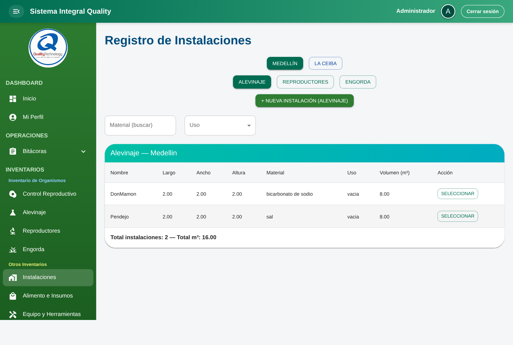
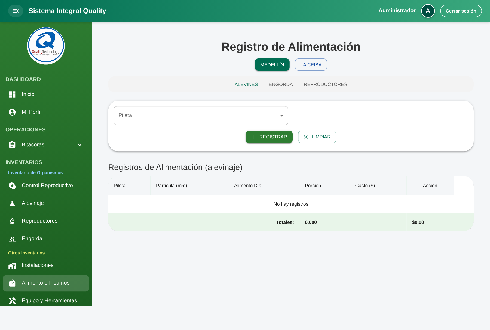

# Flujo para llenar los módulos de Inventarios

Guía paso a paso del orden correcto para capturar datos en el módulo **Inventarios** del sistema, respetando las dependencias reales entre componentes del frontend y los endpoints del backend.

> Cada módulo depende de datos previamente creados en otro. Llenarlos fuera de orden causa que los selectores aparezcan vacíos y los registros no se puedan guardar.

## 1. Mapa de dependencias

```
┌───────────────────┐
│   Instalaciones   │  ← BASE. Todo se apoya aquí.
│  (Alev / Rep / Eng)│
└─────────┬─────────┘
          │
     ┌────┼────────────────────────┬──────────────────┐
     ▼    ▼                        ▼                  ▼
┌──────────────┐  ┌──────────────────────┐   ┌──────────────┐
│ Reproductores│  │      Lotes           │   │   Equipos    │
│  (Tipo Rep)  │  │ (instalaciones con   │   │ (indepen-    │
└──────┬───────┘  │  reproductores)      │   │  diente)     │
       │          └──────────┬───────────┘   └──────────────┘
       │                     │
       └─────────┬───────────┘
                 │
                 │ (opcional: trazabilidad hacia siembras con
                 │  destino en pileta — ver pestaña Alevinaje)
                 ▼
        ┌────────────────────────┐
        │  Piletas físicas       │  ← CRUD del modelo `Pileta`
        │  (tipo alevinaje /     │     (dimensiones, material, estado…)
        │   reproductores /      │
        │   engorda)             │
        └───────────┬────────────┘
                    ▼
        ┌────────────────────────┐
        │  Registros de          │  ← Tabla `alevinaje`: organismos por
        │  Alevinaje             │     pileta; lote y cantidades
        └───────────┬────────────┘
                    │
                    ▼
        ┌────────────────────────┐
        │    Engorda             │  ← pileta destino tipo engorda;
        │                        │     origen opcional = otra pileta
        └───────────┬────────────┘
                    │
                    ▼
        ┌────────────────┐
        │    Alimentos   │  ← Se alimentan Alevines | Engorda | Reproductores
        └────────────────┘
```

## 2. Orden correcto de captura

| # | Módulo | Ruta | Depende de |
|---|---|---|---|
| 1 | Instalaciones | `/inventarios/instalaciones` | — |
| 2 | Reproductores | `/inventarios/reproductores` | Instalaciones (tipo *Reproductores*) |
| 3 | Lotes | `/inventarios/lotes` | Reproductores (habilita la instalación como origen de lote) |
| 4 | Piletas físicas + Alevinaje | `/inventarios/piletas` (pestaña Alevinaje por defecto) y `/inventarios/piletas-fisicas` (abre en piletas) | Para **registrar alevinaje**: al menos una pileta **tipo *Alevinaje*** en la sede activa. La vinculación a **siembra de ingreso** es opcional y solo muestra opciones si ya existen siembras con destino en esa pileta (`GET /siembras`). |
| 5 | Engorda | `/inventarios/engorda` | Al menos una pileta **tipo *Engorda*** en la sede; **origen** opcional (`origen_pileta_id`) desde `listPiletas` |
| 6 | Alimentos | `/inventarios/alimentos` | Piletas / Engordas / Reproductores existentes |
| 7 | Equipos | `/inventarios/equipos` | Independiente (puede llenarse en cualquier momento) |

**Antes de empezar:** elige siempre la **granja activa** (`Medellín` o `La Ceiba`) con los botones del encabezado. Cada granja tiene su propio inventario aislado.

---

## 3. Paso 1 — Instalaciones

**Ruta:** `/inventarios/instalaciones`
**Archivo:** `src/features/inventarios/components/Instalaciones.jsx`
**Servicio:** `src/features/inventarios/services/instalacionesService.js`



### Qué representa
La infraestructura física (tinas, piletas, estanques) donde se colocan los organismos. Es el **cimiento** de todo lo demás.

### Pasos
1. Elegir la granja (MEDELLÍN / LA CEIBA).
2. Elegir el **tipo** de instalación a registrar (`Alevinaje`, `Reproductores`, `Engorda`).
3. Click en **`+ Nueva Instalación ({tipo})`**.
4. Llenar el formulario:
   - `Nombre` — nombre único (ej. "Pileta A-01").
   - `Largo`, `Ancho`, `Altura` — en metros.
   - `Material` — texto libre (ej. "Concreto", "Fibra").
   - `Estado` — `vacia` | `ocupada`. Déjalo en `vacia` al crear.
   - `Tipo` — debe coincidir con el tipo seleccionado arriba.
5. Click en **REGISTRAR**.

### Qué habilita
- **Tipo "Reproductores"** → aparece como opción en el selector *Instalación (origen/destino)* de `Reproductores.jsx` y en el selector *Instalación* de `LotesRegistro.jsx`.
- **Tipo "Alevinaje"** y **"Engorda"** → siguen siendo la referencia de infraestructura para otros flujos que aún usan **instalaciones**; el módulo de **piletas** (`Pileta.jsx`) trabaja con el modelo **`Pileta`** (pestaña *Piletas físicas*), no selecciona instalaciones como destino de siembra.
- **Tipo "Engorda"** → las instalaciones tipo engorda pueden seguir usándose donde el dominio lo relacione; en la pantalla actual de **Engorda** los selectores cargan **piletas** por tipo (`listPiletas`), no el catálogo de instalaciones.

### Errores frecuentes
- Crear una instalación con **tipo distinto** al requerido por el módulo siguiente → no aparecerá en su selector.
- El campo `estado` se actualiza automáticamente a `ocupada` al sembrar; no lo cambies manualmente a menos que sea un ajuste.

---

## 4. Paso 2 — Reproductores

**Ruta:** `/inventarios/reproductores`
**Archivo:** `src/features/inventarios/components/Reproductores.jsx`
**Servicio:** `src/features/inventarios/services/reproductoresService.js`


### Qué representa
Los peces reproductores (machos y hembras) alojados en instalaciones tipo *Reproductores*. Generan los huevos que derivan en los lotes.

### Prerrequisito
Al menos una instalación tipo **`Reproductores`** creada en la granja activa.

### Pasos
1. Elegir la granja.
2. Click en **`+ NUEVO REGISTRO`**.
3. Llenar el formulario:
   - `Origen`: `Interno` (seleccionar instalación ya existente) o `Externo` (texto libre con la procedencia).
   - `Destino` (`fc_instalacion`): la instalación donde se alojan.
   - `Machos`, `Hembras` → el sistema calcula automáticamente `Cantidad` y `Ratio`.
   - `Talla (gr)`, `Línea`, `Familia`, `Observación`.
   - `Fecha siembra`, `Última biometría`.
4. Click en **REGISTRAR**.

### Qué habilita
- La instalación donde se registró el reproductor queda vinculada a una `familia`, lo que permite que esa instalación aparezca en el selector de **Lotes** (endpoint `/lotes/instalaciones/:granja`) y autocomplete la familia al seleccionarla.

### Errores frecuentes
- Dejar `Origen = Interno` sin seleccionar instalación: el sistema validará y no dejará guardar.
- Cambiar a `Externo` pero dejar el texto vacío: misma validación.

---

## 5. Paso 3 — Lotes

**Ruta:** `/inventarios/lotes`
**Archivo:** `src/features/inventarios/components/LotesRegistro.jsx`
**Servicio:** `src/features/inventarios/services/lotesService.js`


### Qué representa
Cada lote es una **camada** producida por los reproductores: número de lote, ovadas, cantidad de huevos por ml, alevines disponibles y mortalidad.

### Prerrequisito
Al menos un **reproductor** registrado, cuya instalación aparezca en `listInstalaciones(granja)` (la consulta filtra por instalaciones que tienen reproductores).

### Pasos
1. Elegir la granja.
2. Llenar el formulario:
   - `Fecha` del lote.
   - `Instalación` — seleccionar la instalación de reproductores. Al elegirla, el campo `Familia` se **autocompleta** (vía `getFamiliaPorInstalacion`).
   - `Huevos (ml)`, `Ovadas`.
   - `No. Lote` — solo letras, números y guion (se convierte a mayúsculas). Ej: `L-001`.
   - `Observación`.
3. Click en **Registrar Lote**.

### Qué habilita
- Los lotes quedan asociados a la instalación de reproductores y a la **familia**; son la base del ciclo de huevos/alevines en ese circuito. La pantalla actual de **piletas / alevinaje** ya **no** consume este catálogo como selector de origen (el lote en alevinaje es un **texto** capturado en el formulario). En **Engorda**, el origen es una **pileta** (`origen_pileta_id`), no el listado de lotes de este módulo.

### Campos ocultos al crear (se llenan más adelante)
- `mortalidad` se inicia en `0`.
- `alevines_inicial` se puede capturar al registrar o ajustarse después editando el lote.

### Errores frecuentes
- Si la instalación seleccionada no tiene familia asociada, `Familia` se queda vacía y no pasa la validación.
- Usar caracteres inválidos en `No. Lote` (espacios, símbolos) — el input los bloquea pero la validación se dispara.

---

## 6. Paso 4 — Piletas físicas y Alevinaje

**Rutas:** `/inventarios/piletas` (menú **Alevinaje**, primera pestaña *Alevinaje*) y `/inventarios/piletas-fisicas` (menú **Piletas físicas**, primera pestaña *Piletas físicas*).

**Páginas:** `src/pages/inventarios/PiletaPage.jsx` (`initialMainTab={0}`) y `src/pages/inventarios/PiletasFisicasPage.jsx` (`initialMainTab={1}`).

**Componente único:** `src/features/inventarios/components/Pileta.jsx`

**Servicios:** `piletasService.js` (CRUD de piletas), `alevinajeService.js` (registros de alevinaje), `siembraService.js` (`listSiembras` para el combo opcional).


### Qué representa (flujo actual)

1. **Piletas físicas** — Inventario de **estanques reales** como filas del modelo `Pileta`: nombre, dimensiones (largo/ancho/alto → volumen), material, estado (`vacia` | `ocupada`) y **etapa** (`alevinaje` | `reproductores` | `engorda`). Son las unidades que después aparecen en Engorda, Reproductores, Biometrías, etc.
2. **Alevinaje** — Registros operativos (**modelo `alevinaje`**): qué **pileta** (solo las de tipo `alevinaje`), **lote** (texto), fechas, huevos/ml, ovadas, **alevines iniciales**, mortalidad y observación (hasta 500 caracteres; se refleja como observación de pileta con proceso `alevinaje`).

El encabezado usa **`useUbicacionesGranja`**: botones de sede/granja y, cuando aplica, `ubicacion_id` en las peticiones (misma convención que el resto de inventarios).

### Orden recomendado dentro del módulo

1. Elegir **sede/granja** arriba.
2. Pestaña **Piletas físicas** → **`Nueva pileta`**: crear al menos una pileta con **Etapa = Alevinaje** (sin esto, la pestaña Alevinaje muestra advertencia y el selector de pileta queda vacío).
3. Pestaña **Alevinaje** → **`Nuevo registro`**: elegir pileta, datos del lote y cantidades.

### Pestaña «Siembra de ingreso» (opcional)

Tras elegir **pileta**, el combo **«Siembra de ingreso (reproductores → esta pileta)»** llama a `GET /siembras` con la ubicación actual y `pileta_destino` = pileta elegida. Las opciones enlazan el registro de alevinaje con una **siembra** ya existente cuyo destino es esa pileta. Si no hay siembras, el campo puede quedar **Sin vincular**; no es obligatorio para guardar.

### Qué habilita aguas abajo

- Piletas **tipo alevinaje** con registros de alevinaje alimentan el selector **Pileta** en la pestaña **Alevines** de `Alimentos.jsx` (`listPiletasByGranja`).
- Las piletas (todas las etapas) participan en **Engorda** y **Reproductores** como origen/destino según su `tipo`.

### Reglas y errores frecuentes (frontend)

- Validación local en alevinaje: obligatorios **pileta**, **lote**, **alevines iniciales**, **fecha**; mortalidad porcentual es calculada en pantalla.
- **Eliminar** una pileta física (`removePileta`) puede fallar si el backend tiene integridad referencial; revisar el mensaje de error del API.
- Confundir **nombre de pileta** con **código de lote**: el lote en esta pantalla es independiente del módulo **Lotes** (`/inventarios/lotes`).

---

## 7. Paso 5 — Engorda

**Ruta:** `/inventarios/engorda`
**Archivo:** `src/features/inventarios/components/Engorda.jsx`
**Servicio:** `src/features/inventarios/services/engordaService.js`


### Qué representa
El registro de organismos en **piletas tipo engorda**, con **pileta origen** opcional para trazabilidad (típicamente desde alevinaje u otra etapa). La pantalla no usa el catálogo de instalaciones ni el selector de lotes del módulo Lotes.

### Prerrequisito
- Al menos una pileta **tipo `engorda`** y otra pileta (cualquier tipo) como **origen** opcional en la sede activa; los selectores usan `listPiletas` con filtro de ubicación/granja.

### Pasos
1. Elegir la granja/sede.
2. Click en **`+ NUEVO REGISTRO`**.
3. Llenar:
   - `Pileta origen (opcional)` — cualquier pileta de la granja si aplica trazabilidad.
   - `Pileta destino (engorda)` — solo piletas tipo engorda.
   - `Cantidad`, `Talla (Gr)`, `Observación`.
4. Click en **Registrar** (`createEngorda`).

### Qué habilita
- El registro aparece en el selector *Instalación Engorda* de la pestaña **Engorda** en `Alimentos.jsx`.
- Genera un movimiento en la **trazabilidad** (historial de movimientos abajo en la misma pantalla).

### Errores frecuentes
- Cantidad u operación inválida según reglas del backend (stock, integridad, etc.): revisar el mensaje de error del API.
- Olvidar seleccionar **pileta destino** tipo engorda u omitir campos obligatorios (`cantidad`, `talla_gr`, `observacion`).

---

## 8. Paso 6 — Alimentos

**Ruta:** `/inventarios/alimentos`
**Archivo:** `src/features/inventarios/components/Alimentos.jsx`
**Servicio:** `src/features/inventarios/services/alimentosService.js`



### Qué representa
El registro de **alimentación diaria** por unidad productiva. Tiene tres pestañas independientes: `Alevines`, `Engorda`, `Reproductores`.

### Prerrequisito (por pestaña)
- **Alevines**: al menos una pileta registrada (paso 4).
- **Engorda**: al menos un registro de engorda (paso 5).
- **Reproductores**: al menos un reproductor registrado (paso 2).

### Pasos
1. Elegir la granja.
2. Elegir la pestaña (`Alevines` | `Engorda` | `Reproductores`).
3. Seleccionar la unidad productiva correspondiente en el dropdown:
   - Pestaña **Alevines** → selector `Pileta` (muestra `nombre_instalacion`).
   - Pestaña **Engorda** → selector `Instalación Engorda`.
   - Pestaña **Reproductores** → selector `Reproductor`.
4. Click en **Registrar**.

### Qué hace el backend
Crea un registro en la tabla `alimentos` vinculado a `fi_pileta_id` / `fi_engorda_id` / `fi_reproductor_id`. Los cálculos posteriores (`partícula_mm`, `alimento_dia`, `porcion`, `gasto_alimento`) se derivan de otros módulos (por ejemplo, biometrías).

### Errores frecuentes
- El selector de piletas aparece vacío → revisar que hay piletas creadas en la granja activa (nombre exacto `Granja Acuícola Medellin` o `Granja Acuícola La Ceiba`).
- Dropdown muestra piletas sin alevines (cantidad = 0): hoy el filtro solo es por granja, no por cantidad. Es comportamiento actual, no un bug.

---

## 9. Paso 7 — Equipos (independiente)

**Ruta:** `/inventarios/equipos`
**Archivo:** `src/features/inventarios/components/Equipos.jsx`
**Servicio:** `src/features/inventarios/services/equiposService.js`


### Qué representa
Inventario de **equipos y herramientas** del usuario logueado (bombas, redes, sensores, etc.) con su historial de mantenimientos.

### Particularidades
- No depende de granja: se carga por `usuario_id` (`listEquipos(usuario_id)`).
- Se puede registrar en cualquier momento, sin orden previo.

### Pasos
1. Llenar el formulario con los campos marcados como obligatorios:
   - Identificación: `Nombre`, `Marca`, `Modelo`, `Tipo`.
   - Compra: `Fecha Compra`, `Costo`.
   - Estado: `Estado` (`Operativo` | `En mantenimiento` | `Dañado`).
   - Ubicación: `Ubicación`, `Responsable`.
   - Mantenimiento: `Próximo Mantenimiento`, `Notas`.
2. Click en **Guardar**.
3. Desde la tabla, el botón con ícono de herramienta abre el diálogo de **Mantenimientos**, donde se registra cada visita (`Fecha`, `Tipo`, `Responsable`, `Descripción`, `Costo`, `Estado posterior`, `Próximo mantenimiento`).

### Extras
- **Exportar PDF**: genera un PDF con logo dinámico según el nombre del usuario (`medellin`, `ceiba`, default `quality`).

---

## 10. Resumen rápido (checklist)

Para llenar los inventarios **desde cero en una granja nueva**, sigue este checklist sin saltarte pasos:

- [ ] **1. Instalaciones** — crear al menos una por cada tipo que vayas a usar (`Alevinaje`, `Reproductores`, `Engorda`).
- [ ] **2. Reproductores** — asignar reproductores a las instalaciones tipo *Reproductores*.
- [ ] **3. Lotes** — crear lotes a partir de esas instalaciones (la familia se hereda).
- [ ] **4. Piletas físicas + Alevinaje** — crear piletas tipo *Alevinaje* en la pestaña *Piletas físicas* y luego los registros en la pestaña *Alevinaje* (vinculación a siembra opcional).
- [ ] **5. Engorda** — registrar engorda en piletas **tipo engorda**, con origen en otra pileta si aplica.
- [ ] **6. Alimentos** — registrar la alimentación diaria por pestaña (Alevines / Engorda / Reproductores).
- [ ] **7. Equipos** — cuando haga falta, sin orden forzado.

## 11. Punto clave sobre granjas

Todos los módulos filtran por `fc_granja` usando los textos exactos:

- `Granja Acuícola Medellin`
- `Granja Acuícola La Ceiba`

Si no ves datos que sabes que existen, lo primero a revisar es que el botón de granja activa del componente coincida con el `fc_granja` de la tabla en la BD. Algunos componentes normalizan el texto (quitando acentos/minúsculas) antes de mandarlo al backend; otros lo mandan tal cual. Verificar ambos lados ante cualquier inconsistencia.

## 12. Archivos de referencia rápida

| Capa | Archivos relevantes |
|---|---|
| Rutas | `src/app/router.jsx` (sección *Inventarios*) |
| Páginas | `src/pages/inventarios/*.jsx` |
| Componentes | `src/features/inventarios/components/*.jsx` |
| Servicios HTTP | `src/features/inventarios/services/*.js` |
| Axios base | `src/shared/lib/axiosInstance.js` |
| Hooks compartidos | `src/shared/hooks/useFormValidation.js`, `useConfirm.js`, `useSnackbar.jsx` |

## 13. Regenerar capturas

Las capturas viven en `docs/images/inventarios/` (`01-instalaciones.png` … `07-equipos.png`). Fueron tomadas con una sesión logueada sobre `http://localhost:3000`, viewport `1440×900`, `deviceScaleFactor: 1.25`, en `fullPage`.

Si cambia la UI y hay que actualizarlas, se puede hacer con Playwright siguiendo estos pasos:

```bash
mkdir -p /tmp/inv-screenshots && cd /tmp/inv-screenshots
bun init -y && bun add -d playwright && bunx playwright install chromium
```

Crear `capture.mjs` con el siguiente contenido (mismo script que se usó originalmente):

```javascript
import { chromium } from "playwright";
import { mkdirSync } from "node:fs";

const BASE = process.env.APP_URL || "http://localhost:3000";
const USER = process.env.APP_USER;
const PASS = process.env.APP_PASS;
const OUT = process.env.OUT_DIR;

mkdirSync(OUT, { recursive: true });

const routes = [
  { slug: "01-instalaciones", path: "/inventarios/instalaciones" },
  { slug: "02-reproductores", path: "/inventarios/reproductores" },
  { slug: "03-lotes", path: "/inventarios/lotes" },
  { slug: "04-piletas", path: "/inventarios/piletas" },
  { slug: "05-engorda", path: "/inventarios/engorda" },
  { slug: "06-alimentos", path: "/inventarios/alimentos" },
  { slug: "07-equipos", path: "/inventarios/equipos" },
];

const browser = await chromium.launch({ headless: true });
const context = await browser.newContext({
  viewport: { width: 1440, height: 900 },
  deviceScaleFactor: 1.25,
});
const page = await context.newPage();

await page.goto(`${BASE}/login`, { waitUntil: "networkidle" });
await page.getByRole("textbox", { name: /usuario/i }).fill(USER);
await page.locator('input[type="password"]').fill(PASS);
await page.getByRole("button", { name: /acceder/i }).click();
await page.waitForURL((url) => !url.pathname.startsWith("/login"), { timeout: 15000 });

for (const r of routes) {
  await page.goto(`${BASE}${r.path}`, { waitUntil: "networkidle" });
  await page.waitForTimeout(1200);
  await page.screenshot({ path: `${OUT}/${r.slug}.png`, fullPage: true });
}

await browser.close();
```

Ejecutar:

```bash
APP_USER='tu_usuario' \
APP_PASS='tu_password' \
OUT_DIR='/ruta/absoluta/a/QualityTechnology-Frontend/docs/images/inventarios' \
bun capture.mjs
```

> El dev server del frontend debe estar corriendo (`bun run dev`) y el usuario debe tener acceso al módulo `Inventarios`. Usa credenciales de **pruebas**, nunca de producción.
